# <sub></sub> MarsCONE 2.0

MarsCONE is a tool for the automatic morphometric analysis of volcanic cones using digital elevation models (DEMs).
The application recognizes volcanic features on Mars and on Earth.  

MarsCONE 2.0 is a PySide6 desktop application for running the MarsCONE processing
pipeline and reviewing its outputs in a single GUI. It is designed as a thin
desktop layer on top of the existing core modules in `dev/`, with extra
tools for visual QA, manual correction, complex-cone aggregation, and
cross-dataset comparison.

The MarsCONE 2.0 does not execute code in `dev/` in place. Instead, it copies the
selected module folders into a temporary runtime workspace, generates fresh
`config.json` files for them, and runs the copied code there. This reduces the
risk of accidental edits to the development sources and makes each run more
reproducible.

## Documentation Map

- [README.md](README.md): MarsCONE 2.0 GUI overview, workflows, tabs, and output conventions.
- [INSTALL.md](INSTALL.md): installation, Conda environment setup, and OS-specific notes.
- [dev/README.md](dev/README.md): core MarsCONE CLI documentation for Generator, Finder, and Analyzer.
- [dev/PIPELINE_USAGE.md](dev/PIPELINE_USAGE.md): command-line pipeline runner usage.
- [dev/EXPECTED_OUTPUTS.md](dev/EXPECTED_OUTPUTS.md): expected output files and formats.

If you want to use the desktop application, start here. If you want to understand
or run the underlying processing modules directly, use [dev/README.md](dev/README.md).

## What The MarsCONE 2.0 Covers

The application currently covers these workflows:

- configure project paths and module parameters,
- run `generator`, `finder`, and `analyzer` separately or as one full pipeline,
- inspect analyzer results and input diagnostics,
- generate and review cross-section figures and metrics,
- manually correct finder points on cross-sections,
- generate DEM overlays for visual QA,
- define and summarize complex cones,
- elevations explorer for problematic cones,
- explore plots for a single dataset,
- compare multiple datasets in a shared metric space.

## Runtime Model

The GUI is intentionally separated from the core processing code in `dev/`.

When you run a module from the MVP folder:

1. the app reads the current form state,
2. it builds a module-specific `config.json`,
3. it copies the required source folder from `dev_root` into `.runtime/session_*`,
4. it runs the copied module with the selected Python interpreter,
5. it streams logs back into the desktop UI,
6. it reloads relevant results when the process finishes.

This behavior is implemented in `marscone_mvp/pipeline.py`.

## Requirements

Use the same Python environment that can already run the MarsCONE modules from
`dev/`. MarsCONE 2.0 also requires PySide6 and the geospatial/scientific stack used
by the project.

Typical environment:

```bash
conda activate marscone
conda env update -n marscone -f marscone_env.yml --prune
python MVP/main.py
```

For detailed, platform-specific installation instructions and the recommended
correct setup procedure, see [INSTALL.md](INSTALL.md).

The codebase expects libraries that are already used throughout MarsCONE,
including at least:

- PySide6
- pandas
- numpy
- matplotlib
- geopandas
- rasterio
- shapely

Video tutorial:

[](https://youtu.be/1dHleOnAUo8)

Direct link: https://youtu.be/1dHleOnAUo8

## Demo Dataset With MarsCONE

GUI uses the same demo dataset as the standard MarsCONE workflow: `test_set`.

If you already downloaded demo data for MarsCONE, GUI can reuse it directly
without downloading anything again. The default `base_path` now points to:

- `dev/data/test_set` relative to the repository root.

If `test_set` is not available yet, download it exactly as in MarsCONE docs
using the existing downloader script:

```bash
conda activate marscone
python dev/download_demo_data.py --data-dir dev/data
```

This will create:

```text
dev/
	data/
		test_set/
			input/
				crop/
				dem/
				points/
			output/
```

After download, set `Dev root` to your MarsCONE `dev` folder and use
`Base path = <dev_root>/data/test_set` if it is not picked automatically.


Video tutorial:

[](https://youtu.be/eWm7wjfa0WM)

Direct link: https://youtu.be/eWm7wjfa0WM

## Quick Start

1. Create the environment using [INSTALL.md](INSTALL.md), then activate it with `conda activate marscone`.
2. Start the application from the repository root with `python MVP/main.py`.
3. In the `App` tab, set `Dev root`, `Base path`, and `Python executable`.
4. Review generator, CRS, finder, and analyzer parameters.
5. Click `Validate paths` to verify the current dataset layout.
6. Click `Run full pipeline` or run individual modules.
7. Use the remaining tabs to inspect, correct, and compare outputs.

For the command-line Generator/Finder/Analyzer workflow, see [dev/README.md](dev/README.md).


Video tutorial:

[](https://youtu.be/yoiDoCZxY9g)

Direct link: https://youtu.be/yoiDoCZxY9g


## Required Directory Layout

The MarsCONE 2.0 works with two main roots:

### `dev_root`

This must point to the MarsCONE core workspace that contains the runtime modules:

```text
dev/
	generator-py/
	finder-py/
	analyzer-py/
```

### `base_path`

This must point to one dataset workspace. The GUI builds most default paths from
this folder.

Expected structure:

```text
base_path/
	input/
		dem/
		crop/
		points/
	db/
		database.gpkg
	output/
		generator/
			dem/
				cropped/
				slope/
			profiles/
				whole/
				cropped/
		finder/
			finder_method.csv
		analyzer/
			results.csv
			cone_summary.csv
			fix_cone_summary.csv
			shapes/
		figures/
			cross_sections/
			dem_overlay/
			complex_cones/
```

Not every file exists from the start. Only the input folder is required to start
processing. Some outputs are generated by the pipeline or by the QA tools in
later tabs.

## Recommended Workflow

### Standard processing workflow

1. Configure `App` parameters.
2. Run `generator`.
3. Run `finder`.
4. Run `analyzer`.
5. Review the results table and logs.
6. Use `Cross-section`, `DEM overlay`, and `Graphs` for QA.

### Manual correction workflow

1. Generate cross-sections in the `Cross-section` tab.
2. Load the current preview into `Manual Fix`.
3. Save corrected points to `manual_point_overrides.csv`.
4. Re-run `Analyzer` with `Use manual fix` enabled.
5. Review updated metrics in `Graphs`, `Dataset compare`, or `Complex Cones`.

### Complex or breached cone workflow

1. Inspect the cone in `DEM overlay` and `Cross-section`.
2. Use `Elevation Explorer` for manual profile inspection if needed.
3. Define multi-cone systems in `Complex Cones`.
4. Compute aggregated outputs and export merged DEM previews.

## Tabs And Options

The main window is assembled in `marscone_mvp/main_window.py` from mixins in
`marscone_mvp/tabs/`. Each section below describes the actual UI that is exposed
today.

### App

Implemented in `marscone_mvp/tabs/app_tab.py`.

This tab is the control center for project configuration, pipeline execution,
results loading, diagnostics, and logs.

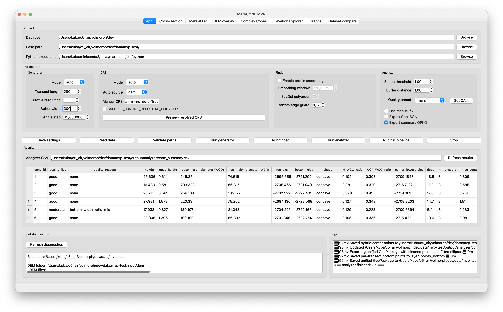

#### Project group

- `Dev root`: folder containing `generator-py`, `finder-py`, and `analyzer-py`.
- `Base path`: dataset root containing input, output, and database folders.
- `Python executable`: interpreter used to launch pipeline scripts.

#### Parameters group

Generator:

- `Mode`: `auto`, `masks`, or `points`.
- `Transect length`: total profile length around each cone center.
- `Profile resolution`: sampling step along a transect.
- `Buffer width`: corridor half-width used during profile extraction.
- `Angle step`: angular spacing between transects.

CRS:

- `Mode`: `auto` or `manual`.
- `Auto source`: prefer CRS from `dem`, `masks`, or `points`.
- `Manual CRS`: manual EPSG or PROJ value.
- `Set PROJ_IGNORE_CELESTIAL_BODY=YES`: relax body mismatch checks.
- `Preview resolved CRS`: show the CRS that would be used with the current state.

Finder:

- `Enable profile smoothing`: turn Savitzky-Golay smoothing on or off.
- `Smoothing window`: smoothing window length in meters.
- `SavGol polyorder`: polynomial order for smoothing.
- `Bottom edge guard`: fraction of the outer profile treated as a no-pick edge zone.

Finder smoothing tuning (important):

- Start from `Enable profile smoothing = off` to verify baseline point detection.
- Then enable smoothing and begin with `Smoothing window = 60-120 m` and `SavGol polyorder = 2` (or `3` for slightly stronger curvature fitting).
- Increase `Smoothing window` gradually (for example by `10-20 m`) only when profile noise causes unstable picks.
- If many `*_top` points move close to center or get `fallback_highest_in_segment`, smoothing is too strong for the current transect geometry.
- As a practical rule, avoid windows close to full transect length; very large windows can merge two rim peaks into one broad center hump.
- Keep `Bottom edge guard` near default (`0.12`) unless edge picks are clearly wrong in a specific dataset.

Analyzer:

- `Shape threshold`: threshold used for profile shape classification.
- `Buffer distance`: geometry buffer distance used by analyzer routines.
- `Quality preset`: `mars`, `terrestrial`, or `bathymetry`.
- `Set QA...`: edit the threshold set used by the current quality preset.
- `Use manual fix`: apply saved manual point overrides during analyzer runs.
- `Export GeoJSON`: export per-transect diagnostics.
- `Export summary GPKG`: export GeoPackage summary layers.

Quality thresholds available through `Set QA...`:

- minimum transects,
- height RMSE ratio warning thresholds,
- bottom-width RMSE ratio warning thresholds,
- bottom elevation RMSE warning thresholds,
- center-to-top RMSE warning thresholds.

Quality outputs written by Analyzer (`cone_summary.csv` / `fix_cone_summary.csv`):

- `quality_flag`: overall class with fixed values `good`, `moderate`, `poor`.
- `quality_score`: numeric mapping of `quality_flag` (`good=2`, `moderate=1`, `poor=0`).
- `quality_reasons`: semicolon-separated reason codes that triggered warnings, or `none`.

How the final quality class is assigned:

- `poor`: at least 2 severe threshold exceedances.
- `moderate`: exactly 1 severe exceedance, or at least 1 moderate exceedance.
- `good`: no exceedances.

Important:

- Users can tune QA thresholds per dataset (preset + overrides), but output labels are fixed (`good`, `moderate`, `poor`).
- There is no separate `failure_category` column in Analyzer outputs in this version; diagnostics are represented by `quality_reasons` codes and runtime logs.

Reason codes currently used in `quality_reasons`:

- `few_transects`
- `height_ratio_mid`
- `height_ratio_high`
- `bottom_width_ratio_mid`
- `bottom_width_ratio_high`
- `bottom_elev_rmse_mid`
- `bottom_elev_rmse_high`
- `center_top_rmse_mid`
- `center_top_rmse_high`
- `none`

Default QA threshold presets:

| Metric | mars | terrestrial | bathymetry |
|---|---:|---:|---:|
| `n_transects_min` | 6 | 6 | 6 |
| `height_ratio_mid` | 0.10 | 0.12 | 0.14 |
| `height_ratio_high` | 0.22 | 0.25 | 0.28 |
| `bottom_width_ratio_mid` | 0.12 | 0.15 | 0.18 |
| `bottom_width_ratio_high` | 0.30 | 0.35 | 0.40 |
| `bottom_elev_rmse_mid` | 8.0 | 12.0 | 18.0 |
| `bottom_elev_rmse_high` | 25.0 | 35.0 | 50.0 |
| `center_top_rmse_mid` | 8.0 | 10.0 | 12.0 |
| `center_top_rmse_high` | 16.0 | 20.0 | 24.0 |

Notes on uncertainty descriptors used by Analyzer:

- Cone-level variability uses transect-based RMSE fields such as `rmse_height`, `rmse_bottom_width`, `rmse_top_elev`, `rmse_bottom_elev`, and `rmse_center_to_top_diff`.
- Normalized and corrected descriptors include `rmse_height_ratio`, `rmse_height_settle_ratio`, `rmse_bottom_width_ratio`, `rmse_bottom_elev_detrended`, and `rmse_bottom_elev_tilt_amp`.

#### Actions row

- `Save settings`
- `Read data`
- `Validate paths`
- `Run generator`
- `Run finder`
- `Run analyzer`
- `Run full pipeline`
- `Stop`

#### Results and diagnostics

- `Results`: loads the analyzer summary table into a Qt table model.
- `Refresh results`: reload current analyzer CSV.
- `Input diagnostics`: prints path and input checks for the selected dataset.
- `Logs`: shows pipeline logs from the active process.

#### Main outputs used by this tab

- `output/finder/finder_method.csv`
- `output/analyzer/results.csv`
- `output/analyzer/cone_summary.csv`
- `output/analyzer/fix_cone_summary.csv`
- `output/analyzer/shapes/*`
- `app_state.json`

### Cross-section

Implemented in `marscone_mvp/tabs/cross_section_tab.py` and backed by
`marscone_mvp/cross_section.py` plus `marscone_mvp/cross_section_cli.py`.

This tab generates figure-based cross-sections from generator profiles and
finder picks, then lets you browse the produced figures and metrics.

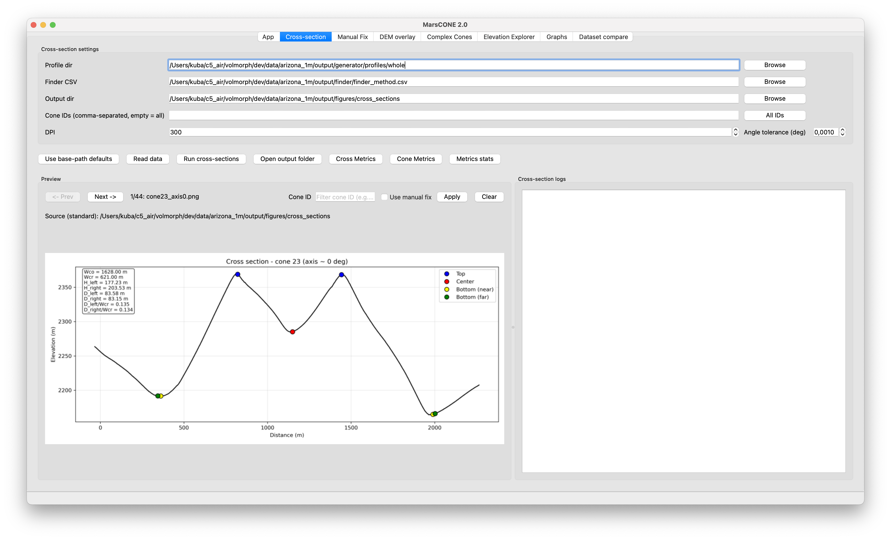

#### Settings

- `Profile dir`: usually `output/generator/profiles/whole`.
- `Finder CSV`: usually `output/finder/finder_method.csv`.
- `Output dir`: usually `output/figures/cross_sections`.
- `Cone IDs`: comma-separated list; empty means all cones.
- `All IDs`: clears the filter.
- `DPI`: output figure resolution.
- `Angle tolerance (deg)`: tolerance used to pair opposite transects.

#### Actions

- `Use base-path defaults`
- `Read data`
- `Run cross-sections`
- `Open output folder`
- `Cross Metrics`
- `Cone Metrics`
- `Metrics stats`

#### Preview controls

- previous and next image navigation,
- cone ID filter,
- `Use manual fix` for previewing corrected variants when available,
- source labels showing the current file and image index.

#### Workflow notes

- This tab depends on outputs from `generator` and `finder`.
- The generated figures are also the source material for the `Manual Fix` tab.
- If you save manual fixes later, rerun `Analyzer` to rebuild metrics.

### Manual Fix

Implemented in `marscone_mvp/tabs/manual_fix_tab.py`.

This tab allows interactive adjustment of the seven key finder points used along
paired cross-section profiles.

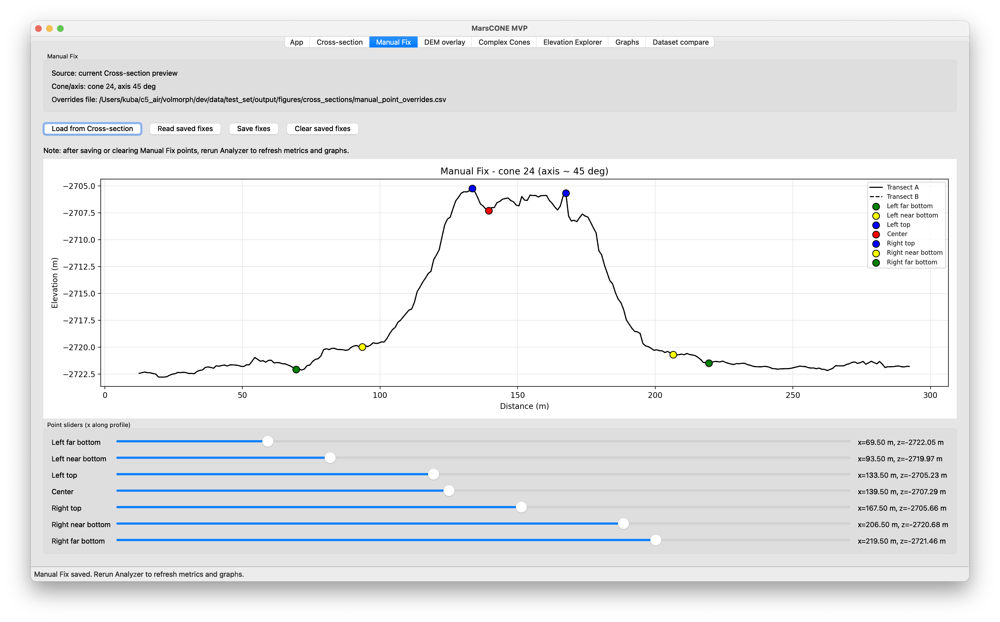

#### Main controls

- `Load from Cross-section`
- `Read saved fixes`
- `Save fixes`
- `Clear saved fixes`

#### Editable slots

Each current cross-section exposes seven sliders:

- left far bottom,
- left near bottom,
- left top,
- center,
- right top,
- right near bottom,
- right far bottom.

The plot updates as slider positions move along the combined profile.

#### Inputs and outputs

- Input: current cross-section preview, finder CSV, and profile CSV files.
- Output: `output/figures/cross_sections/manual_point_overrides.csv`.

#### Critical note

Saving or clearing manual fixes does not update analyzer products automatically.
You must rerun `Analyzer` if you want downstream tables and plots to use the
corrected points.

### DEM overlay

Implemented in `marscone_mvp/tabs/dem_overlay_tab.py` and backed by
`marscone_mvp/dem_overlay.py` plus `marscone_mvp/dem_overlay_cli.py`.

This tab creates hillshaded DEM figures with cone geometry overlays for visual
review of analyzer outputs.

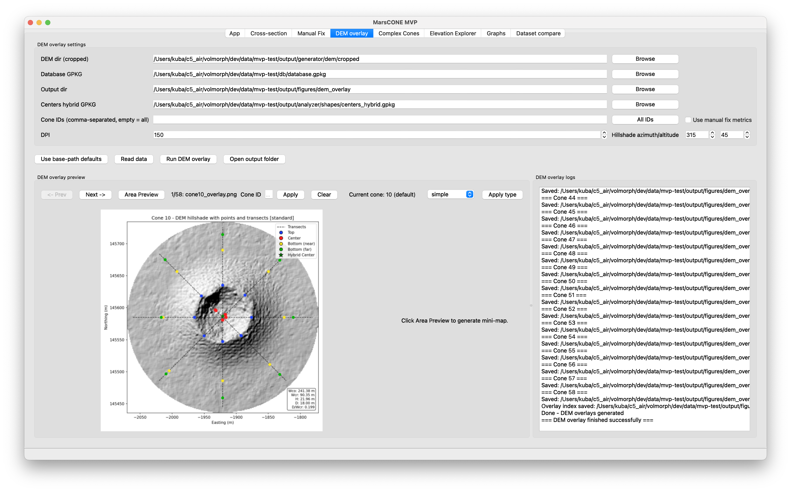

#### Settings

- `DEM dir (cropped)`: folder of cropped DEM rasters per cone.
- `Database GPKG`: GeoPackage with cone layers.
- `Output dir`: folder for generated overlay figures.
- `Centers hybrid GPKG`: optional centers layer used by some previews.
- `Cone IDs`: comma-separated filter; empty means all.
- `All IDs`: clears the filter.
- `Use manual fix metrics`: apply manual-fix metrics where supported.
- `DPI`
- `Hillshade azimuth/altitude`

#### Actions

- `Use base-path defaults`
- `Read data`
- `Run DEM overlay`
- `Open output folder`

#### Preview tools

- previous and next navigation,
- `Area Preview` for generating a context mini-map,
- cone ID filter,
- topology override controls for the current cone,
- a split preview showing the overlay image and context view.

#### Notes

- This tab is intended for QA after `generator`, `finder`, and `analyzer`.
- It can incorporate manual-fix outputs and breached-cone overrides.

### Complex Cones

Implemented in `marscone_mvp/tabs/complex_cones_tab.py` and backed by
`marscone_mvp/complex_cones.py`.

This tab handles grouped systems composed of multiple member cones. It is used
for complex morphologies that should not be interpreted only as isolated cones.

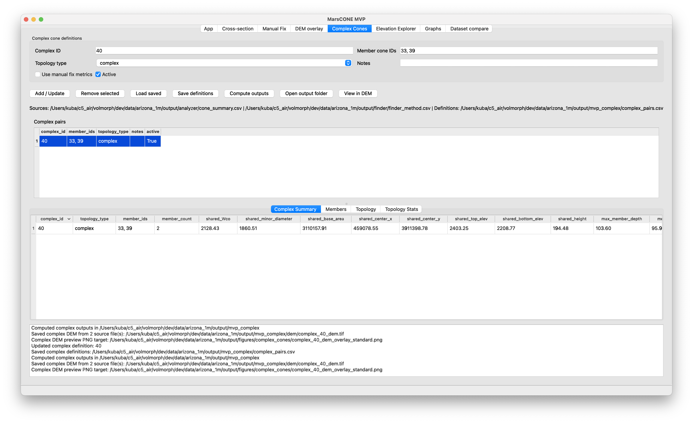

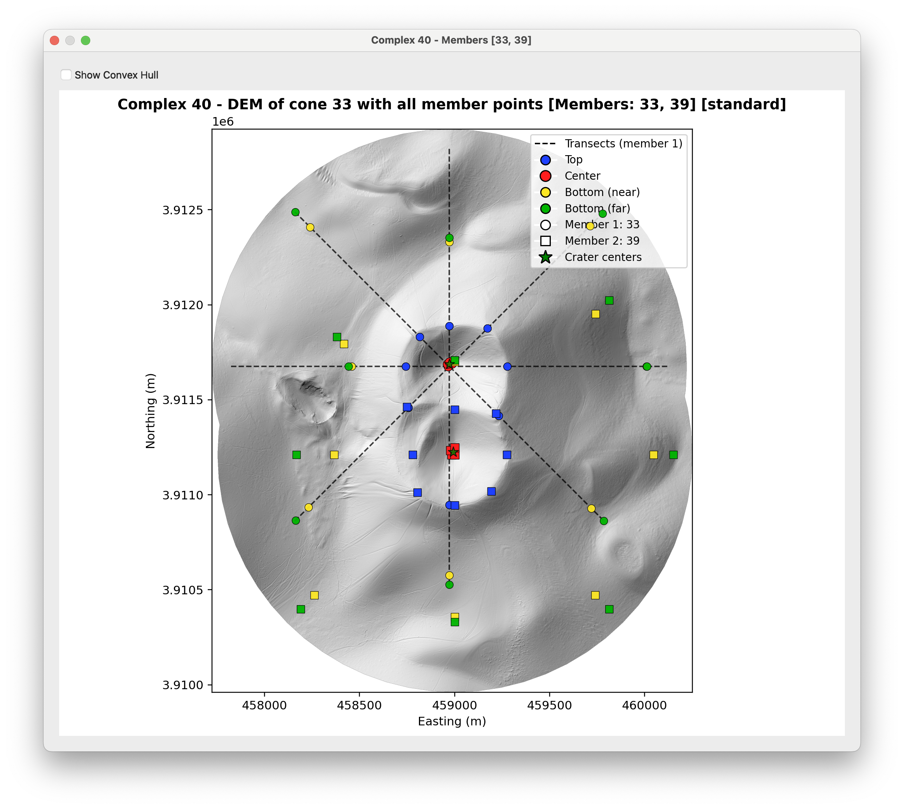

#### Definition fields

- `Complex ID`
- `Member cone IDs`: comma-separated, for example `33, 39`.
- `Topology type`: currently `complex`.
- `Notes`
- `Use manual fix metrics`
- `Active`

#### Actions

- `Add / Update`
- `Remove selected`
- `Load saved`
- `Save definitions`
- `Compute outputs`
- `Open output folder`
- `View in DEM`

#### Tables and outputs

- definition table: `Complex pairs`
- result tabs: `Complex Summary`, `Members`, `Topology`, `Topology Stats`
- log pane for complex processing messages

Main files written to `output/mvp_complex/`:

- `complex_pairs.csv`
- `breached_singles.csv`
- `complex_summary.csv`
- `complex_members.csv`
- `cone_topology.csv`
- `topology_stats.csv`

Additional outputs:

- merged complex DEMs in `output/mvp_complex/dem/`
- complex figures in `output/figures/complex_cones/`

#### Important behavior

- Complex DEM export merges all member DEM rasters for the selected system.
- The merged TIFF stores a source signature tag so stale cached single-source
	outputs are not silently reused.
- Complex summaries depend on analyzer metrics and finder points being available.

### Elevation Explorer

Implemented in `marscone_mvp/tabs/elevation_explorer_tab.py`.

This tab is intended for manual inspection of elevation profiles for individual
cones, especially potentially breached or ambiguous cases.

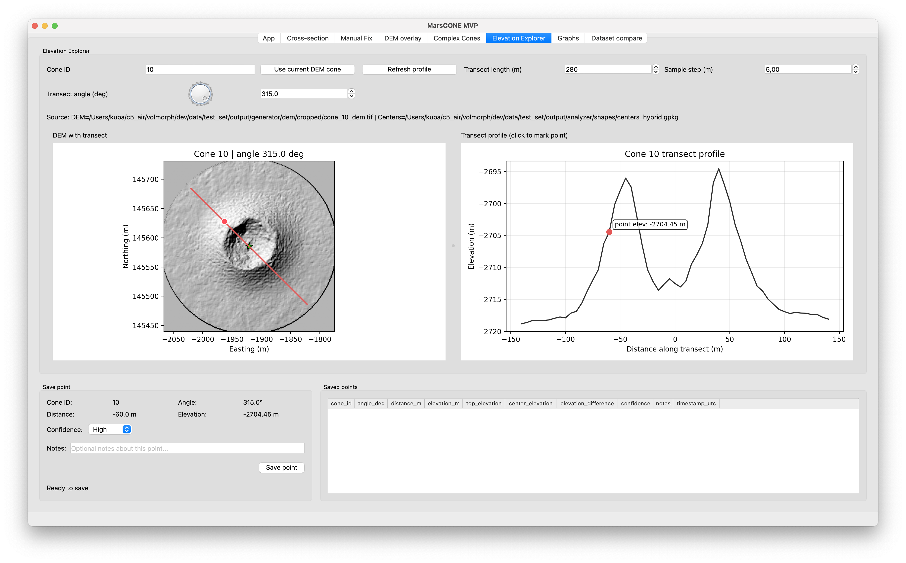

#### Controls

- `Cone ID`
- `Use current DEM cone`
- `Refresh profile`
- `Transect angle` dial and spin box
- `Transect length (m)`
- `Sample step (m)`

The `Suggest angle` and `Suggest point` buttons are present in code but hidden,
because their logic is currently not considered ready.

#### Interactive views

- DEM map with the current transect line,
- transect elevation profile,
- click handling on both the map and the profile canvas.

#### Save point section

- selected cone, angle, distance, and elevation,
- confidence level,
- notes,
- `Save point`.

Saved points are displayed in a table in the lower part of the tab.

### Graphs

Implemented in `marscone_mvp/tabs/graphs_tab.py`.

This tab provides exploratory plots for one dataset. It reloads analyzer summary
CSV files and visualizes them in several ways.

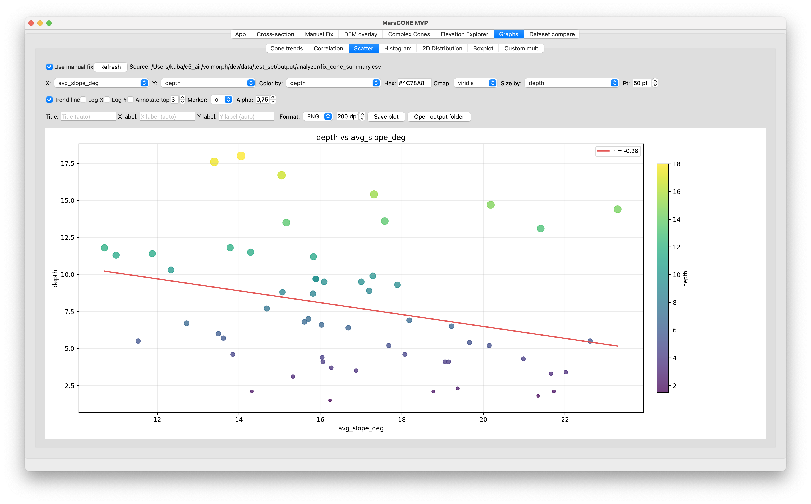

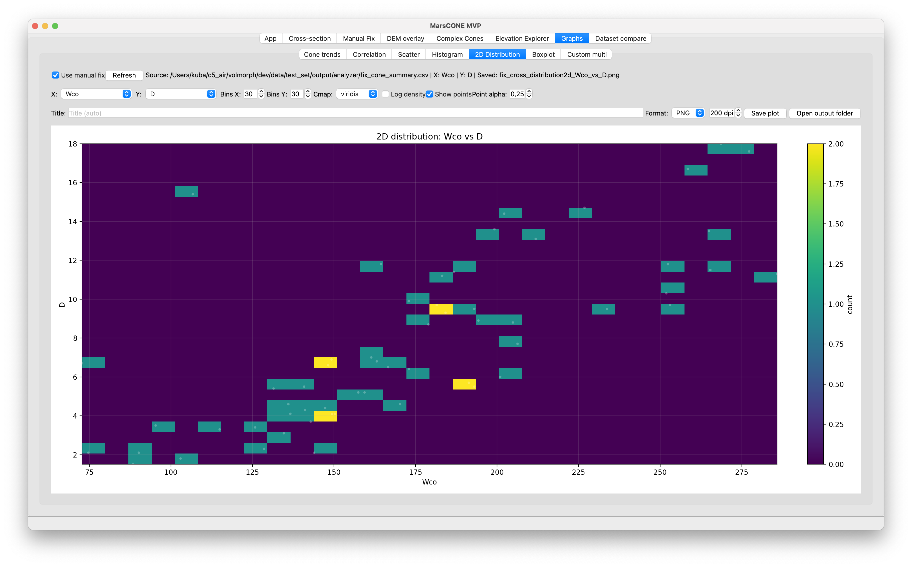

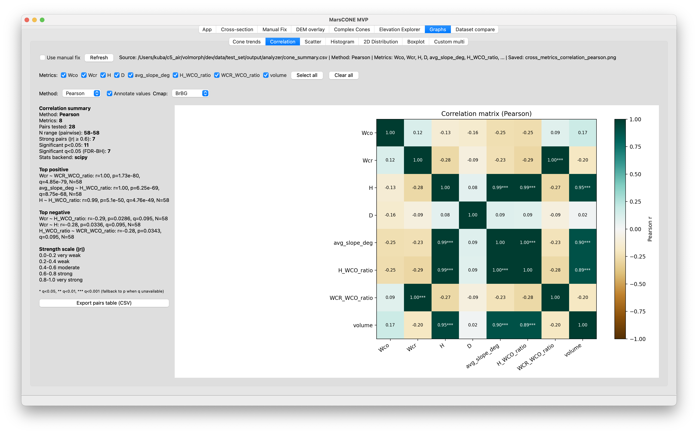

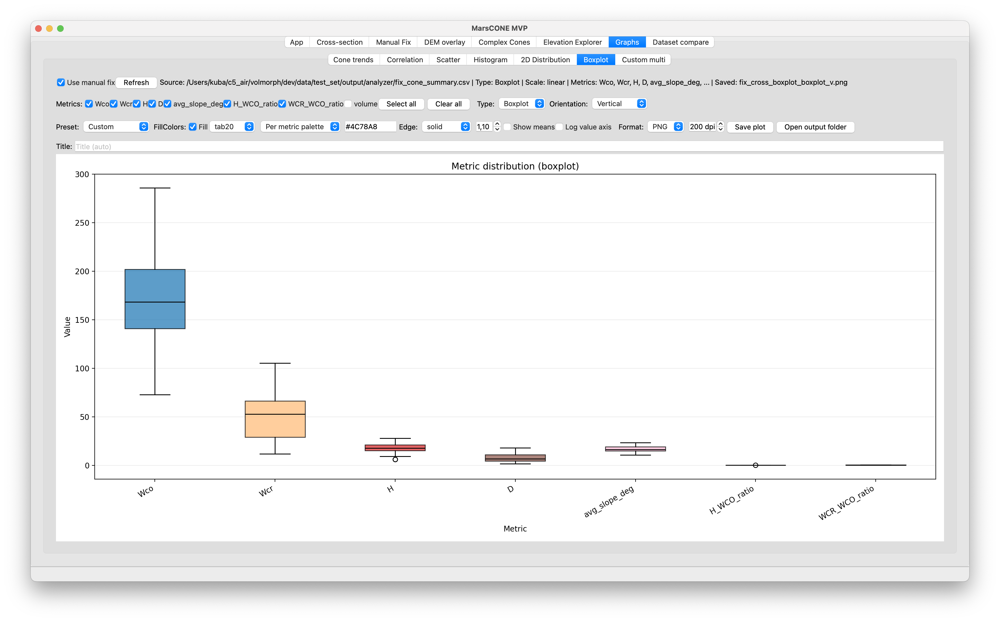

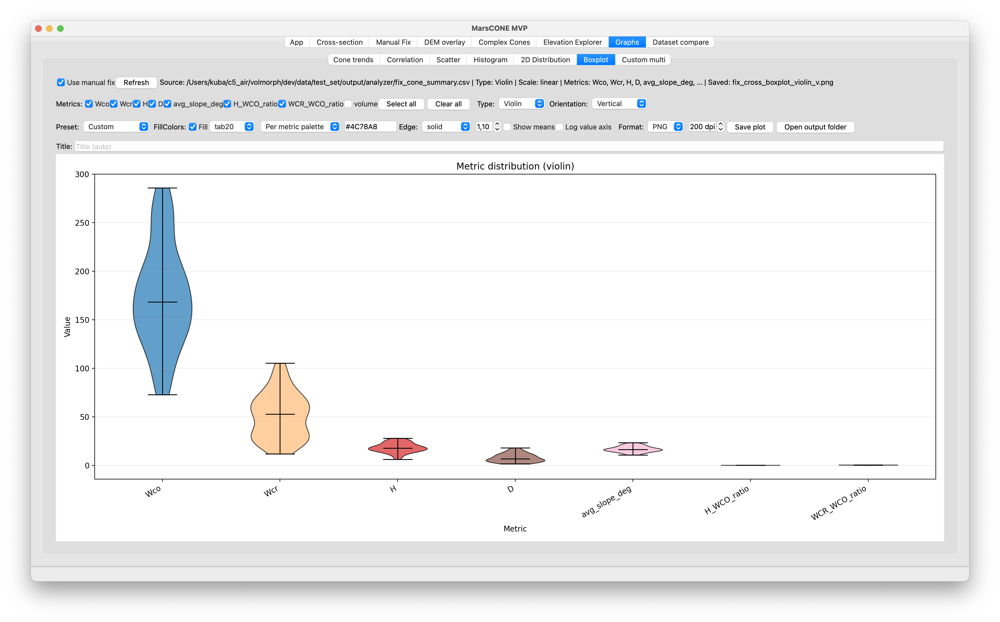

#### Shared idea

Most graph subtabs offer:

- `Use manual fix`
- `Refresh`
- a source label pointing to the current analyzer CSV

#### Subtabs

- `Cone trends`: trend plots of core metrics over cone ID.
- `Correlation`: metric relationship analysis using correlation matrices.
- `Scatter`: single-metric scatter views.
- `Histogram`: one-metric distributions.
- `2D Distribution`: bivariate density-style exploration.
- `Boxplot`: grouped distribution summaries.
- `Custom multi`: multi-panel scatter combinations.

#### Typical source files

- `output/analyzer/cone_summary.csv`
- `output/analyzer/fix_cone_summary.csv`

#### Metrics commonly used across plots

- height,
- depth,
- base major diameter (`WCO`),
- top major diameter (`WCR`),
- `H_WCO_ratio`,
- `WCR_WCO_ratio`,
- volume.

### Dataset compare

Implemented in `marscone_mvp/tabs/dataset_compare_tab.py` and backed by
`marscone_mvp/dataset_compare.py`.

This tab compares multiple datasets against each other in a common metric space.
It is intended for region-to-region, body-to-body, or method-to-method
comparisons.

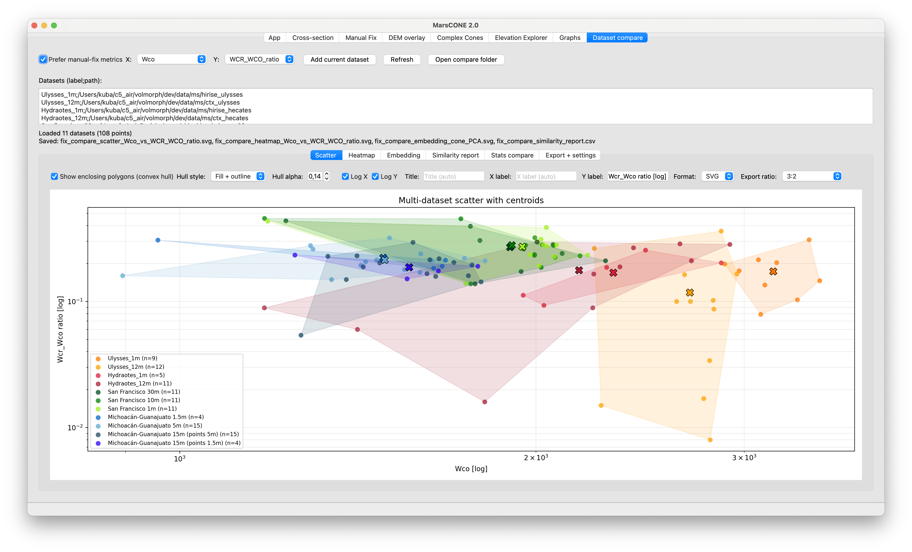

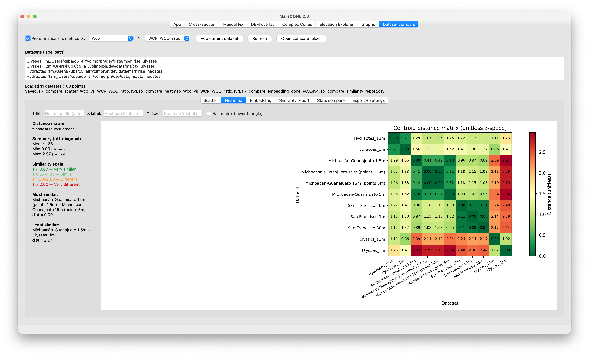

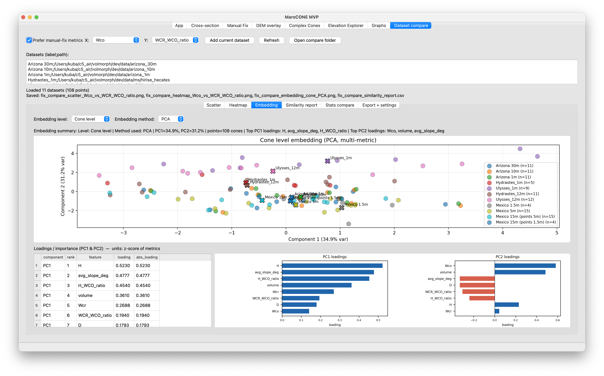

#### Main controls

- `Prefer manual-fix metrics`
- `X` and `Y` metric selectors
- `Add current dataset`
- `Refresh`
- `Open compare folder`

#### Source list

Datasets are entered one per line as:

```text
label;/path/to/base_or_csv
```

You can point either to a dataset base directory or directly to a summary CSV.
If a base directory is used, the tab resolves either `cone_summary.csv` or
`fix_cone_summary.csv` automatically.

#### Compare subtabs

- `Scatter`: colored per-dataset point cloud with centroids.
- `Heatmap`: pairwise centroid distance matrix in standardized space.
- `Embedding`: PCA or UMAP-style low-dimensional embedding, depending on
	availability and fallback behavior.
- `Similarity report`: ranked pairwise similarity table.
- `Stats compare`: per-dataset summary statistics and deltas vs reference.
- `Export + settings`: color, marker, size, and export-path controls.

#### Styling and analysis options

- custom per-dataset colors,
- scatter and embedding marker selection,
- scatter and embedding point size,
- `Show enclosing polygons (convex hull)`,
- hull style and alpha,
- `Log X` and `Log Y`,
- `Show reference rows` in the stats table,
- dataset-level or cone-level embedding.

#### Exported outputs

Written to `output/analyzer/dataset_compare/`:

- scatter PNG,
- heatmap PNG,
- embedding PNG,
- points CSV,
- centroid distance CSV,
- similarity report CSV,
- stats compare CSV,
- embedding CSV,
- loadings CSV.

## Backend Module Map

### Entry and application bootstrap

- `main.py`: application entry point.
- `marscone_mvp/app.py`: Qt application startup and window bootstrap.
- `marscone_mvp/main_window.py`: main window assembly and shared constants.

### State and configuration

- `marscone_mvp/app_state.py`: default state, state loading, and persistence to
	`app_state.json`.
- `marscone_mvp/config_templates.py`: generates runtime configs for generator,
	finder, and analyzer based on the current GUI state.
- `marscone_mvp/crs.py`: CRS detection and manual CRS resolution helpers.

### Runtime pipeline layer

- `marscone_mvp/pipeline.py`: copies source modules into `.runtime/`, writes
	configs, launches processes, and emits logs/status back to the GUI.

### Cross-section tools

- `marscone_mvp/cross_section.py`: core logic for generating cross-section
	figures and metrics.
- `marscone_mvp/cross_section_cli.py`: command-line wrapper used by the GUI.

### DEM overlay tools

- `marscone_mvp/dem_overlay.py`: hillshade generation, DEM plotting, overlay
	drawing, and manual-fix integration.
- `marscone_mvp/dem_overlay_cli.py`: command-line wrapper used by the GUI.

### Complex and comparative analysis

- `marscone_mvp/complex_cones.py`: schema handling, member parsing, aggregated
	outputs, topology derivation, and merged DEM helpers for complex systems.
- `marscone_mvp/dataset_compare.py`: metric extraction, dataset feature matrix
	construction, similarity ranking, and embedding helpers.

### Shared UI data handling

- `marscone_mvp/table_model.py`: Qt table model used across results tables.
- `marscone_mvp/tabs/shared_helpers.py`: helper logic reused by multiple tabs.

## Config And State Details

The persisted UI state is stored in `app_state.json` in the MVP root.

State includes:

- project paths,
- generator settings,
- finder settings,
- analyzer settings,
- QA thresholds,
- cross-section settings,
- DEM overlay settings,
- dataset compare settings.

The default state assumes:

- `dev_root = ../dev` relative to the `MVP/` folder, which is `dev/` from the repository root
- a default dataset at `../dev/data/test_set` relative to `MVP/`, which is `dev/data/test_set` from the repository root
- a Mars-style manual CRS value already filled in
- `PROJ_IGNORE_CELESTIAL_BODY` enabled by default

## Output Conventions

The GUI relies on a few output conventions across modules.

### Generator outputs

- cropped DEM rasters,
- slope rasters,
- whole and cropped transect profiles,
- GeoPackage layers in `db/database.gpkg`.

### Finder outputs

- `output/finder/finder_method.csv`

### Analyzer outputs

- `output/analyzer/results.csv`
- `output/analyzer/cone_summary.csv`
- `output/analyzer/fix_cone_summary.csv` when manual fix is used
- shape and summary layers in `output/analyzer/shapes/`

### QA and visualization outputs

- `output/figures/cross_sections/*`
- `output/figures/cross_sections/manual_point_overrides.csv`
- `output/figures/dem_overlay/*`
- `output/figures/complex_cones/*`
- `output/analyzer/dataset_compare/*`
- `output/mvp_complex/*`

## Important Caveats

- The GUI is a desktop orchestration and QA layer, not a replacement for the
	underlying module code in `dev/`.
- The GUI depends on the folder conventions described above. If a dataset uses
	different names or locations, you must point the controls to the correct
	paths manually.
- `Manual Fix` changes only become visible in downstream metrics after rerunning
	`Analyzer` with manual fix enabled.
- `Cross-section`, `DEM overlay`, `Graphs`, `Complex Cones`, and `Dataset compare`
	all assume that the earlier pipeline stages have already produced the relevant
	CSV, GPKG, and raster outputs.


## File Overview

- `main.py`: start the desktop application.
- `marscone_mvp/app.py`: Qt bootstrap.
- `marscone_mvp/main_window.py`: tab composition and shared window state.
- `marscone_mvp/pipeline.py`: isolated runtime execution.
- `marscone_mvp/config_templates.py`: generated configs for runtime sessions.
- `marscone_mvp/app_state.py`: persistent settings.
- `marscone_mvp/crs.py`: CRS resolution.
- `marscone_mvp/cross_section.py`: cross-section generation logic.
- `marscone_mvp/cross_section_cli.py`: CLI wrapper for cross-sections.
- `marscone_mvp/dem_overlay.py`: DEM overlay logic.
- `marscone_mvp/dem_overlay_cli.py`: CLI wrapper for DEM overlays.
- `marscone_mvp/complex_cones.py`: complex-cone analysis.
- `marscone_mvp/dataset_compare.py`: multi-dataset comparison utilities.
- `marscone_mvp/table_model.py`: shared Qt table model.
- `marscone_mvp/tabs/*.py`: all tab-specific UI logic.

## Summary

The GUI now covers the full working loop around MarsCONE processing: run the
pipeline, inspect outputs, correct problematic picks, validate results visually,
aggregate complex systems, and compare datasets. If you use the directory and
output conventions described here, each tab should map directly to one stage of
that workflow without requiring manual interpretation of the source code.
